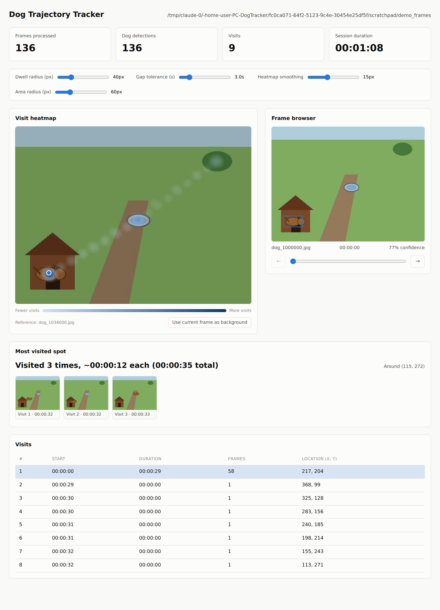
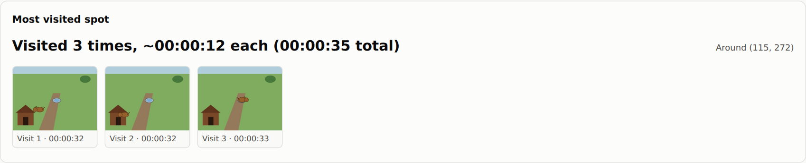
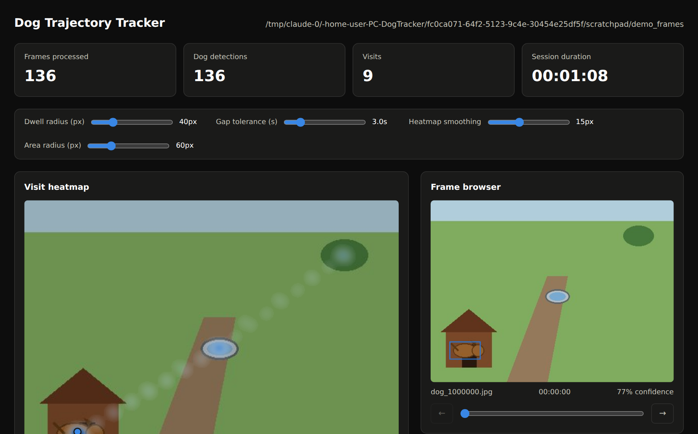

# PC_DogTracker

Offline, one-click Windows tool for the ESP32-S3 Dog Trajectory Tracker project.

Takes the JPEG frames recorded to the ESP32's SD card and runs YOLOv8s object
detection over all of them locally (no internet required), then presents an
interactive heatmap + dwell/visit analysis with click-to-jump frame browsing,
served as a local web UI and packaged as a single `.exe`.



*(Screenshot uses a synthetic demo yard/doghouse scene, not real camera
footage -- generated for illustration purposes, see below.)*

## What you get

- **Visit heatmap** overlaid on a frame from the middle of the session (a
  more representative "what does this scene normally look like" reference
  than frame 0); pick any other frame as the background with one click.
- **Most visited spot** -- the small area the dog returned to most often,
  with a count, average/total dwell time, and one thumbnail per visit.
- **Frame browser** with the detected bounding box drawn on it, a scrubber,
  and prev/next controls.
- **Click-to-jump** everywhere: click a point on the heatmap, a row in the
  visits table, or a thumbnail in the most-visited-spot strip, and the frame
  browser jumps straight to it.
- **Adjustable thresholds** (dwell radius, gap tolerance, area radius,
  heatmap smoothing) recompute the visits/areas/heatmap live.
- Runs entirely on `127.0.0.1`; light/dark mode follow your system.



## How it works

1. Scans the chosen folder for JPEG frames (`frames.py`), parsing a
   timestamp out of each filename (falls back to file mtime).
2. Runs YOLOv8s over each frame looking for the `dog` class, keeping the
   highest-confidence box per frame (`detect.py`). Results are cached per
   folder in `.dogtracker_cache/`, keyed by file size + mtime, so re-opening
   the same session skips detection entirely.
3. Groups detections into **visits** (a contiguous dwell in roughly one
   spot) and **areas** (visits close enough together to count as the same
   small spot, e.g. repeated trips to a doghouse) (`analysis.py`).
4. Serves everything from a small Flask app (`server.py` + `static/`) --
   no telemetry, no external requests, nothing leaves the machine.

## Running from source

```
pip install -r requirements.txt
python run_dogtracker.py                 # prompts for a folder via a file dialog
python run_dogtracker.py path\to\frames   # or pass it directly
```

The first run downloads the `yolov8s.pt` weights (needs internet once); after
that, detections are cached per source folder in `.dogtracker_cache/` so
re-opening the same session is instant. A browser tab opens automatically at
`http://127.0.0.1:5151/`.

Useful flags: `--rescan` (ignore the cache and re-run detection on every
frame), `--no-browser`, `--no-gui` (skip the Tk dialogs; requires passing a
folder), `--port`, `-v`/`--verbose`.

## Building DogTracker.exe (Windows only)

PyInstaller does not cross-compile, so the `.exe` must be built on Windows:

```
packaging\build_exe.bat
```

This installs the build dependencies, downloads the YOLO weights, bundles
them + the web UI assets into the executable, and writes
`dist\DogTracker.exe`. That exe needs no internet connection and no Python
install on the machine that runs it. See `packaging/dogtracker.spec` for the
PyInstaller configuration.

Because it bundles PyTorch/OpenCV, the onefile exe is large (400MB+) and
**re-extracts itself to a temp folder on every launch**, so expect roughly
10-15 seconds of "nothing happening" before the window/browser appears --
that's normal, not a hang. If that startup delay matters more than shipping
a single file, switch `packaging/dogtracker.spec`'s `EXE(...)` to PyInstaller's
`--onedir`-style `COLLECT(...)` output instead; everything else stays the
same.

## Running the tests

```
pip install pytest
pytest
```

## Dark mode

The dashboard follows your OS's light/dark setting automatically.


